# abi-public
an app for collecting quotes, performing surveys, and creating rankings during the last years of school which can then be used in the yearbook

currently a work-in-progress, major remaining tasks are related to regulations and bureaucracy

key features:
- news-stream with newly added comments, quotes, surveys and rankings
- profile views that list all content concerning the selected member
- create a community and invite others to your community
- comment on students and teachers of your community
- quote students and teachers
- appoint administrators to help you keep everything in order
- dark and light mode, with custom primary color
- modern, fast and sleek UI
- search function for news, students and teachers
- SOON: start surveys
- SOON: create rankings

### Screenshots

coming soon

  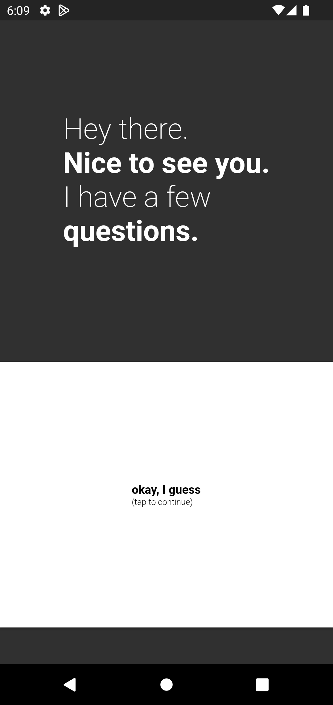
  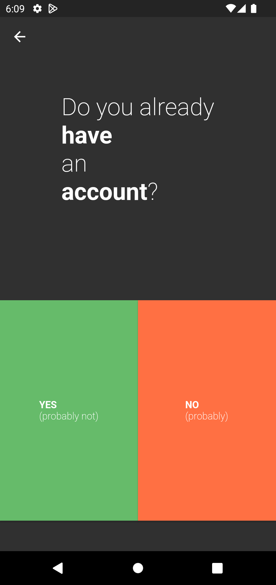
  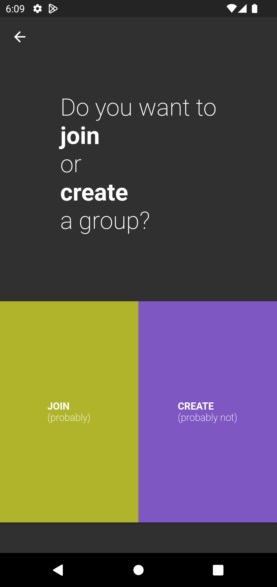
  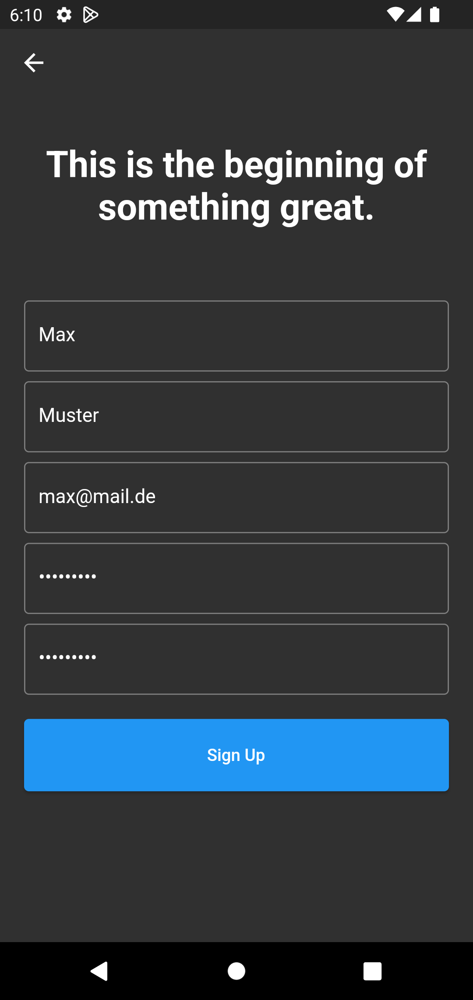

  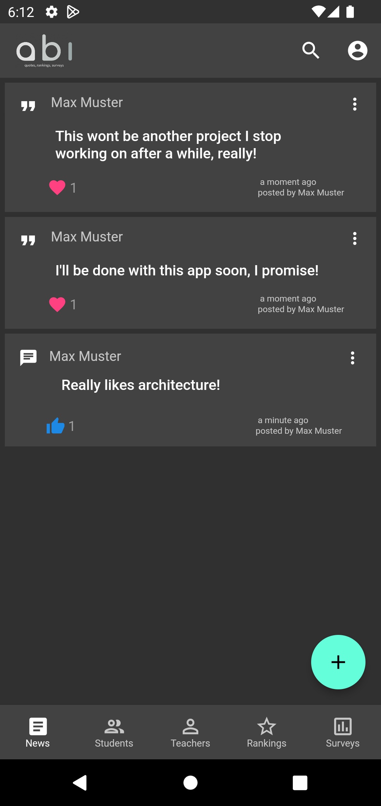
  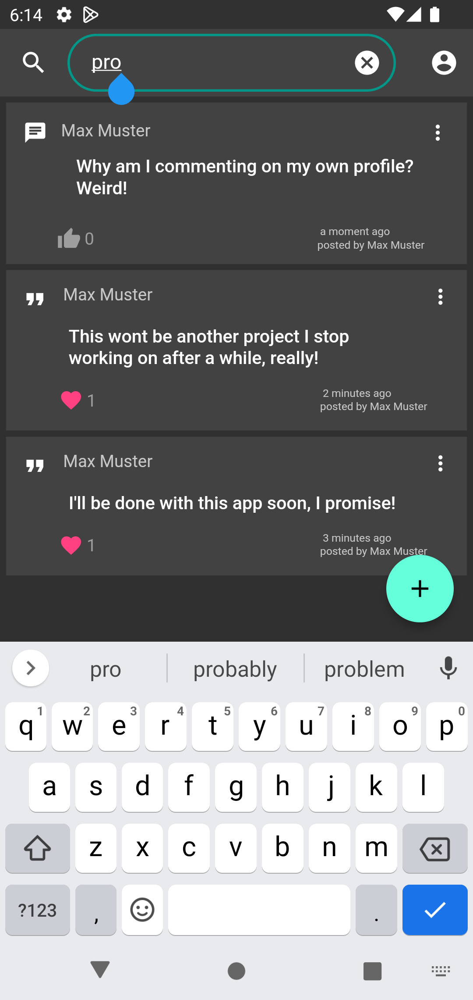
  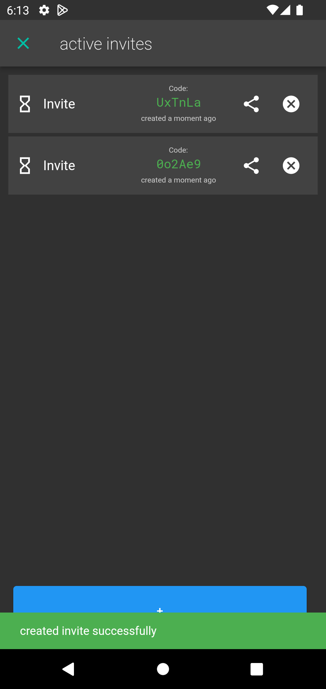
  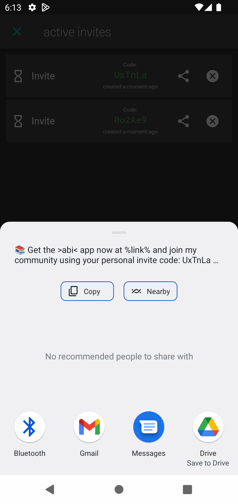

  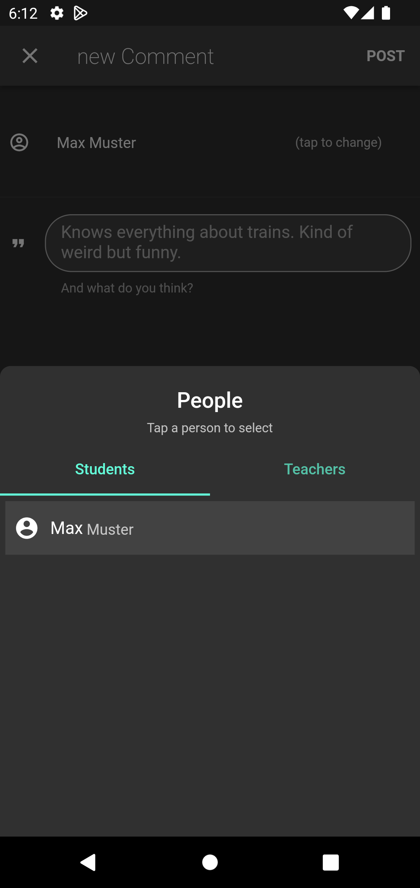
  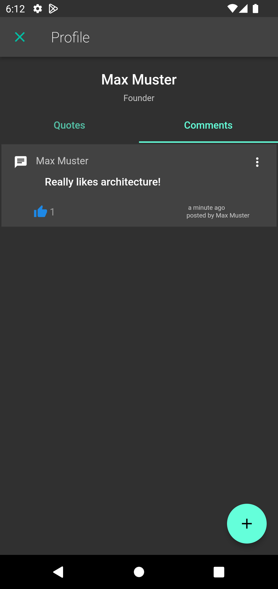
  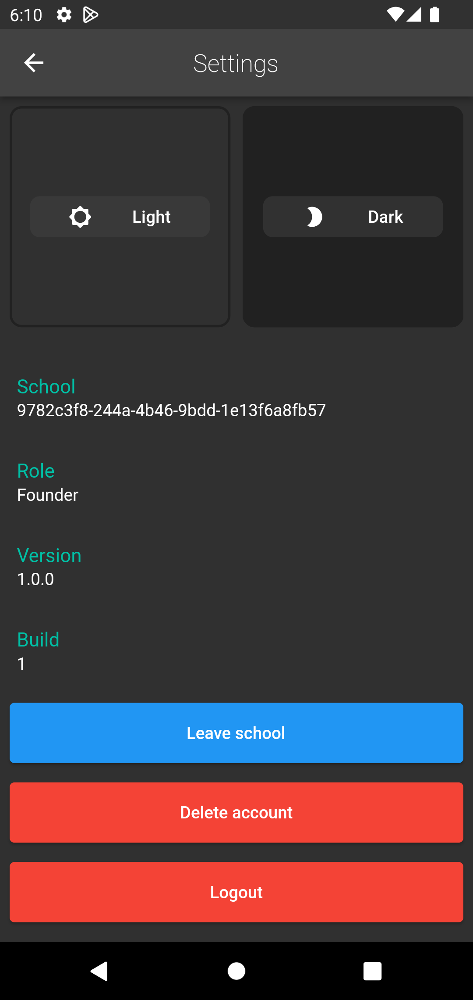
  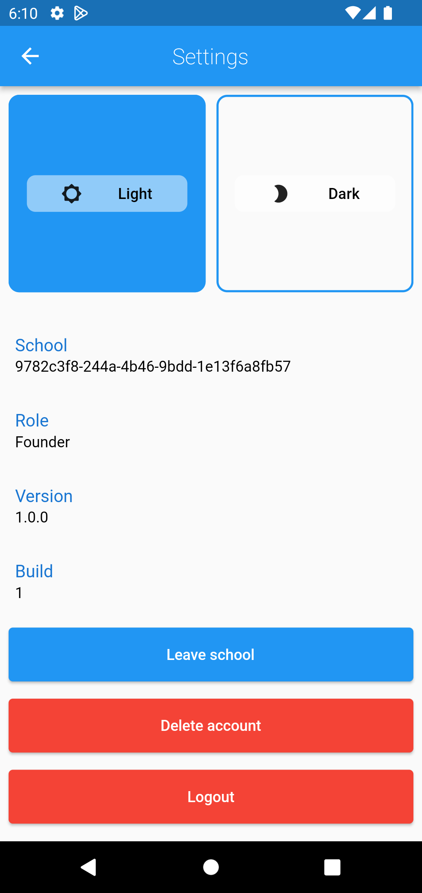

### Implementation

written in Flutter, using VSCode
uses Google Firebase as back-end

closed source as of now
